<div align="center">
<picture>
    <source srcset="https://imgur.com/5bYAzsb.png" media="(prefers-color-scheme: dark)">
    <source srcset="https://imgur.com/Os03JoE.png" media="(prefers-color-scheme: light)">
    
</picture>

<h3>Curso de Robótica 2026-I</h3>

<h1>Proyecto Final - Robótica Industrial</h1>

<h2>Profesores: <br>Pedro Fabián Cárdenas Herrera <br> Manuel Felipe Carranza Montenegro<br></h2>

<p>
  
  
  
</p>

<br>
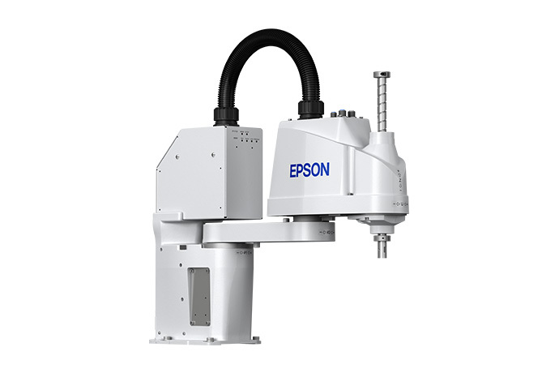<br>
<b>Figura 1. Manipulador industrial EPSON T3-401S.</b>
</div>

</div>

# Integrantes
1. Juan Andrés Moreno Benavides [jumorenobe@unal.co](Jumorenobe)
2. Mateo Ramos Cujer [mramoscu@unal.edu.co](MateoKGR)
3. Paula Valentina Alvarez Chaparro [palvarezch@unal.edu.co] (Vaulentzc)
4. Yesid Camilo Ojeda Hernández [yojeda@unal.edu.co] (YojedaMt)
5. David Felipe Cardenas Cubides [dcardenascu@unal.edu.co] (dcardenascu)

# Índice

1. [Bitácora del desarrollo](#1-bitácora-del-desarrollo)
2. [Diagrama de flujo del proceso global](#2-diagrama-de-flujo-del-proceso-global)
3. [Diseño del gripper](#3-diseño-del-gripper)
4. [Simulación](#4-simulación)
5. [Código fuente](#5-código-fuente)
6. [Comparación manual vs automatizado](#6-comparación-manual-vs-automatizado)
7. [Descripción detallada de la solución](#7-descripción-detallada-de-la-solución)
8. [Diagrama de flujo acciones del robot](#8-diagrama-de-flujo-acciones-del-robot)
9. [Plano de planta](#9-plano-de-planta)
10. [Videos demostrativos](#10-videos-demostrativos)

## 1. Bitácora del desarrollo

A continuación se documenta el proceso cronológico de diseño, simulación, fabricación e integración en laboratorio para el desarrollo de la **Etapa 2: Ensamblaje de Componentes** con el robot **Epson T3 401S ("Junior")**.

---

### Fase 1: Definición de Requerimientos y Diseño Mecánico

#### Definición de requerimientos

El objetivo principal de la herramienta es permitir la manipulación automática de componentes electrónicos mediante un brazo robótico, siendo capaz de recoger una pieza desde una ubicación determinada y depositarla en otra con la mayor precisión posible. Debido a que la aplicación está orientada al manejo de componentes para PCB, resulta especialmente importante mantener la orientación de la pieza durante todo el proceso, ya que una rotación indeseada dificultaría o impediría su colocación correcta.

A partir de estos objetivos se definieron los siguientes requerimientos de diseño:

- Ser capaz de levantar componentes electrónicos de diferentes tamaños.
- Poder activarse y desactivarse mediante una señal de control.
- Mantener la orientación del componente durante el transporte, en la medida de lo posible.
- Tener un diseño mecánico sencillo para facilitar tanto su fabricación como su integración con el brazo robótico.
- Minimizar la complejidad de la simulación y del sistema de control.

Con estos criterios se evaluaron distintas alternativas para la herramienta de agarre.

---

#### Alternativa 1: Ventosa de vacío

La primera opción considerada fue una **ventosa de vacío**, accionada mediante un sistema electroneumático. Esta alternativa presentaba la ventaja de que el laboratorio ya disponía de una herramienta funcional, reduciendo considerablemente el tiempo de diseño y fabricación.


Entre sus principales ventajas se encuentran:

- Diseño ya disponible y probado.
- Activación sencilla mediante electroválvulas.
- Integración relativamente simple con el sistema de control.
- Capacidad de manipular componentes de diferentes materiales.

Sin embargo, durante el análisis se identificaron varias limitaciones importantes para la aplicación propuesta.

La fuerza de succión se distribuye sobre una superficie relativamente amplia, lo que hace que el punto exacto de contacto dependa de la geometría de la pieza. Además, durante el momento en que la ventosa entra en contacto con el componente es frecuente que éste gire o cambie ligeramente de posición antes de quedar completamente adherido.

Como consecuencia, la orientación final del componente resulta poco repetible, lo cual representa una desventaja significativa cuando posteriormente debe colocarse sobre una PCB con una orientación específica.

Por estas razones, aunque la ventosa constituye una solución robusta para tareas generales de manipulación, no se consideró la alternativa más adecuada para este proyecto.

---

#### Alternativa 2: Electroimán

La segunda alternativa consistió en diseñar una herramienta basada en un **electroimán**.

Un electroimán funciona aprovechando el fenómeno del **electromagnetismo**: cuando una corriente eléctrica circula por una bobina, se genera un campo magnético capaz de atraer materiales ferromagnéticos. Al interrumpir la corriente, el campo desaparece prácticamente por completo, permitiendo liberar el componente de manera controlada.

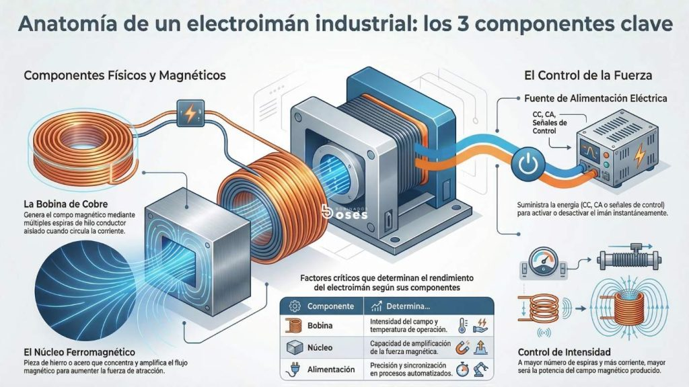

Esta alternativa presentaba varias ventajas frente a la ventosa:

- Activación y desactivación mediante una simple señal eléctrica.
- Mayor precisión en el punto de contacto.
- Menor probabilidad de modificar la orientación del componente durante la recogida.
- Diseño compacto y fácilmente integrable al efector final del robot.
- Capacidad de sujetar componentes metálicos sin necesidad de generar vacío.

No obstante, también fue necesario considerar algunas desventajas:

- La herramienta debía diseñarse y fabricarse prácticamente desde cero.
- Requiere una corriente relativamente elevada para generar una fuerza de atracción suficiente.
- El calentamiento de la bobina produce un aumento de su resistencia eléctrica. Como consecuencia, la corriente disminuye y, con ella, la intensidad del campo magnético generado. Este fenómeno, conocido como **desmagnetización térmica** o **pérdida de fuerza por calentamiento**, provoca una reducción progresiva de la capacidad de sujeción mientras el electroimán permanece energizado.
- Si los componentes se encuentran demasiado próximos entre sí, el campo magnético puede atraer simultáneamente más de una pieza, por lo que es necesario mantener una separación adecuada durante el almacenamiento.

A pesar de estas limitaciones, las ventajas relacionadas con la precisión y el control de la orientación hicieron que esta alternativa resultara considerablemente más adecuada para los objetivos del proyecto.

---

#### Selección de la herramienta

Después de analizar ambas opciones se decidió implementar el **electroimán** como herramienta principal del brazo robótico.

Aunque implicaba un mayor trabajo de diseño y fabricación, esta solución ofrecía un mejor compromiso entre precisión, simplicidad del sistema de control y repetibilidad del proceso de manipulación, aspectos fundamentales para una aplicación orientada al ensamblaje de componentes electrónicos.

La selección del electroimán también hizo necesario diseñar un sistema de almacenamiento para los componentes. Este almacén debía mantener las piezas organizadas, suficientemente separadas para evitar capturas múltiples y con una disposición que facilitara el acceso del brazo robótico.

---

#### Diseño del almacén de componentes

Como complemento de la herramienta se diseñó una caja de almacenamiento que permite organizar los componentes electrónicos antes de ser manipulados.

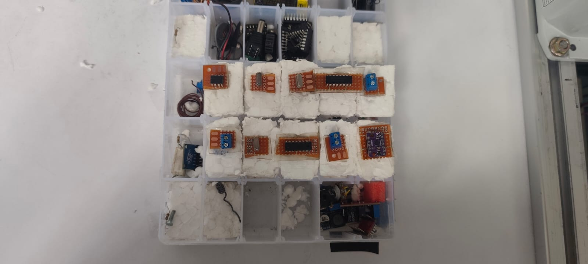

El diseño del almacén busca cumplir varios objetivos:

- Mantener las piezas ordenadas y fácilmente accesibles.
- Evitar que el campo magnético del electroimán capture más de un componente simultáneamente.
- Facilitar la identificación de la posición de cada componente durante la operación.
- Proporcionar una estructura estable para las pruebas experimentales.
- Permitir futuras ampliaciones del sistema para manejar un mayor número de referencias.

Con el diseño mecánico de la herramienta y del sistema de almacenamiento definidos, fue posible avanzar hacia las etapas de fabricación, caracterización del electroimán e integración con el sistema robótico.
> **[Agregen mas info]:** *Agregar especificaciones del material del gripper (impresión 3D PLA/PETG) y dimensiones exactas de la caja/almacén utilizada.*

---

### Fase 2: Programación Inicial y Simulación (EPSON RC+)
#### Desarrollo de código SPEL

Una vez definido el diseño mecánico de la herramienta, se desarrolló el programa de control utilizando el lenguaje **SPEL+** dentro del entorno **EPSON RC+**. El objetivo del software fue automatizar la secuencia completa de ensamblaje, desde la recogida de cada componente en el almacén hasta su colocación en la posición correspondiente de la baquela.

La implementación se estructuró en funciones independientes, permitiendo separar la configuración inicial, la definición de posiciones, la lógica de ensamblaje y el control del efector final. Esta organización facilita el mantenimiento del código y permite modificar cada parte del proceso sin afectar el funcionamiento general del programa.

##### Inicialización del robot

La rutina principal (`main`) es la encargada de preparar el robot antes de iniciar el proceso de ensamblaje. En esta etapa se realizan las siguientes acciones:

- Encendido de los motores.
- Configuración de potencia, aceleración y velocidad de trabajo.
- Retorno a la posición de referencia (*Home*).
- Carga de la información correspondiente a los componentes.
- Ejecución de la rutina principal de ensamblaje.
- Regreso a la posición de inicio una vez finalizado el proceso.

Esta estructura garantiza que el robot siempre comience y termine el ciclo desde una posición conocida y segura.

---

##### Organización de las posiciones

Para evitar programar manualmente cada movimiento del robot, se utilizaron dos arreglos globales:

- `alm(i)`: almacena la posición del componente dentro del almacén.
- `baq(i)`: almacena la posición destino sobre la baquela.

Cada índice representa un componente específico, de modo que ambos arreglos establecen una correspondencia directa entre el punto de recogida y el punto donde debe colocarse.

Por ejemplo, el componente almacenado en `alm(4)` será depositado automáticamente en la posición indicada por `baq(4)`.

Este método permite modificar la distribución física de los componentes simplemente cambiando los índices almacenados en las matrices, sin necesidad de alterar la lógica principal del programa.

---

##### Configuración automática mediante Pallet

En lugar de enseñar individualmente cada una de las posiciones del almacén y de la baquela, se utilizaron las herramientas de **paletizado** incluidas en EPSON RC+.

Se definieron dos mallas de trabajo:

- **Pallet 1:** almacén de componentes, organizado en una matriz de **6 × 6** posiciones.
- **Pallet 2:** baquela, organizada en una matriz de **27 × 22** posiciones.

Cada malla se genera automáticamente a partir de un punto de origen y dos vectores de referencia, permitiendo acceder a cualquier posición mediante un único índice.

Esta estrategia simplifica considerablemente la programación y facilita futuras modificaciones en la distribución de los componentes.

---

##### Secuencia de ensamblaje

La rutina `EnsambleComponentes` ejecuta el ciclo completo para cada uno de los componentes definidos.

Para cada elemento se realiza la siguiente secuencia:

1. Desplazamiento sobre la posición del componente en el almacén.
2. Descenso hasta la altura de recogida.
3. Activación del electroimán.
4. Asociación del componente CAD con la herramienta durante la simulación.
5. Elevación del componente.
6. Desplazamiento hasta la posición correspondiente de la baquela.
7. Descenso hasta la posición de inserción.
8. Desactivación del electroimán para liberar la pieza.
9. Fijación del componente en la simulación mediante el modelo CAD.
10. Elevación del robot para continuar con el siguiente componente.

Esta secuencia se ejecuta dentro de un ciclo `For`, permitiendo ensamblar automáticamente todos los componentes definidos por la variable `NumComponentes`.

---

##### Control del efector final

El accionamiento del electroimán se implementó mediante una salida digital del controlador.

Las funciones `Tomar` y `Soltar` encapsulan esta funcionalidad, permitiendo activar o desactivar el electroimán mediante una única instrucción desde la rutina principal.

Esta separación mejora la legibilidad del programa y facilita futuras modificaciones en caso de reemplazar el efector final por otro tipo de herramienta.

---

##### Integración con la simulación

Con el fin de representar correctamente el proceso dentro del entorno virtual, se implementaron las funciones `PickCAD` y `PlaceCAD`.

Estas funciones utilizan las instrucciones `SimSet` para asociar o liberar el modelo CAD correspondiente a cada componente durante las etapas de recogida y colocación. De esta manera, la simulación reproduce visualmente el comportamiento esperado del sistema sin afectar la lógica utilizada en la implementación real.

La utilización de procedimientos independientes para esta tarea permite desacoplar la simulación del control físico del robot, facilitando tanto las pruebas virtuales como la posterior implementación sobre el equipo real.

> **[Agregen foto de la simulación]:** *Adjuntar captura de pantalla de la simulación en EPSON RC+ con la malla de paletizado generada.*

---

### Fase 3: Integración Hardware y Control Eléctrico

En esta fase se realizó la integración entre el robot, la herramienta de manipulación y el sistema de control eléctrico. Debido a que el electroimán requería un consumo de corriente superior al que podía suministrar directamente la salida del controlador del robot, fue necesario contar con el apoyo del profesor para diseñar una solución de alimentación adecuada. Para ello se implementó un sistema compuesto por dos fuentes de alimentación externas y un módulo relé, el cual permitía que el robot controlara el encendido y apagado del electroimán mediante una señal digital, aislando el circuito de potencia del circuito de control y garantizando un funcionamiento seguro.

Una vez completada la instalación eléctrica se realizaron pruebas de funcionamiento para verificar el correcto accionamiento del electroimán y la sincronización entre el movimiento del robot y la activación de la herramienta. Durante estas pruebas también se validaron los parámetros obtenidos previamente en el gemelo digital, comprobando que las posiciones de aproximación y recogida fueran alcanzables en el sistema físico sin generar colisiones.

La experimentación permitió identificar diversas limitaciones que no habían sido evidentes durante la etapa de simulación. En primer lugar, se determinaron con mayor precisión los límites del eje **Z**, estableciendo la distancia mínima y máxima de operación para garantizar una correcta captura de las piezas sin que la herramienta impactara contra la superficie de trabajo.

Adicionalmente, se observaron restricciones propias del hardware relacionadas con el comportamiento del electroimán durante periodos prolongados de operación. Debido al efecto Joule, la bobina incrementaba progresivamente su temperatura, provocando un aumento de su resistencia eléctrica y una reducción de la corriente que circulaba por ella. Como consecuencia, la fuerza magnética disponible disminuía con el tiempo, afectando directamente la capacidad de sujeción de las piezas.

Esta disminución de la fuerza de agarre produjo comportamientos diferentes dependiendo del tipo de componente manipulado y de su geometría. Algunas piezas eran levantadas correctamente, mientras que otras presentaban ligeros desplazamientos o rotaciones durante el transporte. Estas variaciones en la orientación final se acumulaban a lo largo del proceso y terminaron afectando la precisión del ensamblaje, especialmente en los últimos componentes de la PCB, donde las tolerancias de posicionamiento eran más estrictas.

Los resultados obtenidos en esta fase evidenciaron la importancia de considerar no solo las restricciones cinemáticas y geométricas del sistema, sino también los fenómenos eléctricos y térmicos asociados a la herramienta de manipulación. Estas pruebas permitieron ajustar los parámetros de operación y definir las limitaciones reales del sistema antes de realizar la integración completa del proceso de ensamblaje.

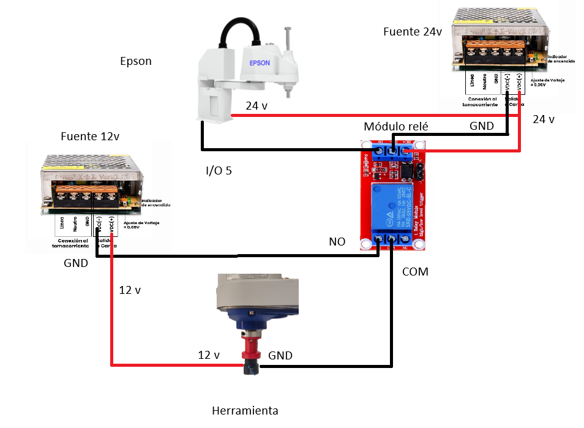
---

### Fase 4: Pruebas en Laboratorio y Calibración de Trabajo (Iterativas)

Una vez validado el funcionamiento del programa en el entorno de simulación, se procedió a realizar la implementación sobre el robot físico. En esta etapa se evidenciaron diferencias importantes entre el modelo virtual y el sistema real, por lo que fue necesario realizar múltiples sesiones de prueba y calibración para garantizar un funcionamiento estable.

A diferencia de la simulación, en el montaje físico intervienen factores como las tolerancias mecánicas, pequeñas desviaciones en la ubicación de los componentes, variaciones en la herramienta de agarre y tiempos de respuesta de los actuadores, los cuales afectan directamente la precisión del proceso de ensamblaje.
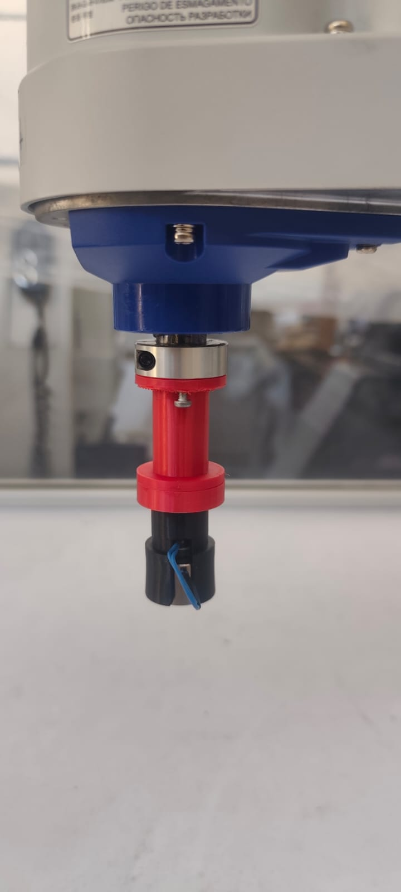
#### Calibración del sistema

La primera etapa consistió en la calibración del espacio de trabajo del robot. Para ello se definieron manualmente los puntos de referencia utilizados por las mallas de paletizado, verificando que las posiciones calculadas coincidieran con la ubicación real tanto del almacén de componentes como de la zona de ensamblaje.

Durante esta fase también se verificaron las dimensiones físicas del montaje y se realizaron pequeños ajustes sobre las coordenadas de referencia hasta obtener una correspondencia aceptable entre las posiciones programadas y las posiciones reales.

Posteriormente se ajustó la altura de seguridad utilizada durante los desplazamientos del robot. Este parámetro debía ser lo suficientemente elevado para evitar colisiones con los bordes del almacén, la baquela y otros elementos presentes en la estación de trabajo, pero sin incrementar innecesariamente el tiempo de ciclo.

#### Ajuste del proceso de manipulación

Una vez calibradas las posiciones, se realizaron pruebas repetitivas para optimizar la recogida y liberación de los componentes mediante el electroimán.

Se añadió físicamente a la caja una capa de icopor, esto para aprovechar mejor el posicionamiento del robot y añadir tolerancia de movimiento, pues el icopor amortigua el contacto y a la vez sostiene los elementos correctamente.

Se ajustó la altura final de aproximación para maximizar el contacto entre el electroimán y la superficie metálica de cada componente, incrementando así la fuerza efectiva de sujeción y reduciendo la probabilidad de desprendimiento durante el transporte, también se usaron diferentes alturas de recogida por la diferencia entre cada elemento.

Adicionalmente, se incorporaron tiempos de espera (`Wait`) en distintos puntos de la secuencia de movimiento. Aunque estos retardos aumentan ligeramente el tiempo total del ciclo, permiten que el robot complete cada movimiento antes de ejecutar la siguiente acción, mejorando la estabilidad del proceso y reduciendo errores ocasionados por pequeñas oscilaciones o tiempos de respuesta del sistema.

También se realizaron ajustes en la velocidad de los movimientos. El objetivo principal fue reducir el tiempo durante el cual el electroimán permanecía energizado, ya que se observó que un funcionamiento prolongado producía un calentamiento considerable de la bobina.

Este aumento de temperatura ocasionaba una disminución gradual de la fuerza magnética disponible, haciendo más probable que el componente se desprendiera durante el transporte. Como consecuencia, fue necesario encontrar un compromiso entre velocidad de desplazamiento, precisión del robot y tiempo máximo de activación del electroimán.
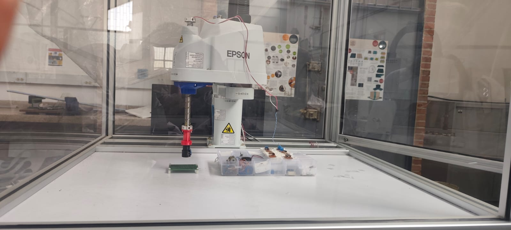
#### Resultados y dificultades encontradas

Durante las pruebas experimentales también se observó que el comportamiento del sistema dependía considerablemente del tipo de componente manipulado.

Las piezas con mayor superficie metálica presentaban un agarre más estable, mientras que componentes pequeños o con menor área de contacto requerían una alineación mucho más precisa para ser levantados correctamente.

Otro aspecto importante identificado durante la experimentación fue la pérdida de orientación de varios componentes durante la fase de recogida y transporte. Aunque el electroimán proporciona un punto de agarre más localizado que una ventosa de vacío, la fuerza magnética no restringe completamente la rotación de la pieza, por lo que pequeños impactos o vibraciones podían modificar su orientación.

Esta situación resultó especialmente crítica al intentar depositar los componentes directamente sobre una PCB, ya que incluso pequeñas variaciones angulares impedían que las piezas coincidieran correctamente con su posición de montaje.

Como resultado de estas pruebas, se decidió utilizar una superficie de depósito plana durante la validación experimental en lugar de realizar el ensamblaje directamente sobre la tarjeta electrónica. Esta decisión permitió evaluar el funcionamiento general del sistema sin introducir errores adicionales asociados a la orientación de los componentes.

También se usó una capa extra compuesta de baquelas recortadas para poder añadir consistencia de posiciones y asi buscar mas precisión de agarre de el electroimán.

Finalmente, las pruebas permitieron identificar las principales limitaciones del efector final basado en un electroimán. Si bien la herramienta demostró ser adecuada para la manipulación automática de componentes electrónicos, la pérdida progresiva de fuerza debido al calentamiento y la dificultad para garantizar una orientación constante representan aspectos que deberán abordarse en futuras iteraciones del diseño.


### Evidencias del Desarrollo

| Hito / Actividad | Descripción | Evidencia Fotográfica / Video |
| :--- | :--- | :---: |
| **Diseño CAD Herramienta** | Modelo 3D del soporte para el electroimán. | *(Insertar Imagen CAD)* |
| **Acondicionamiento Almacén** | Caja seleccionada con componentes ordenados. | *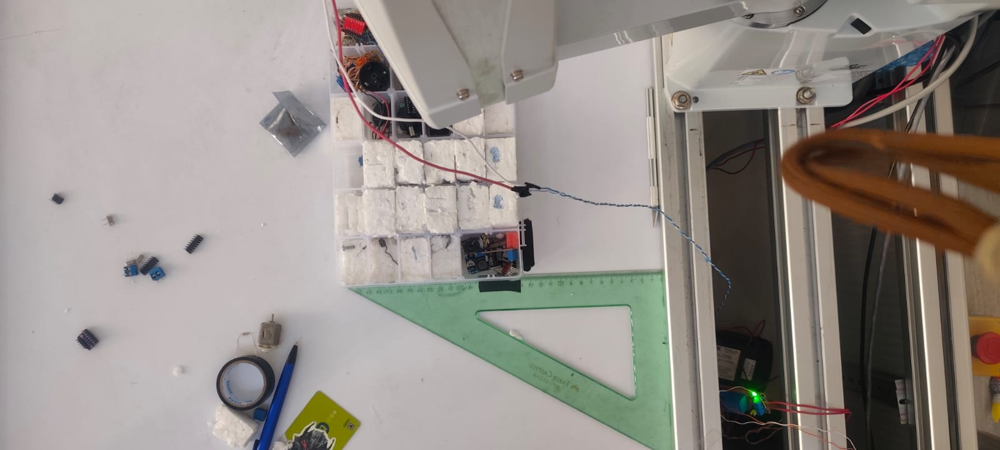* |
| **Calibración en Lab** | Ajuste de puntos de paletizado en el Epson T3. | *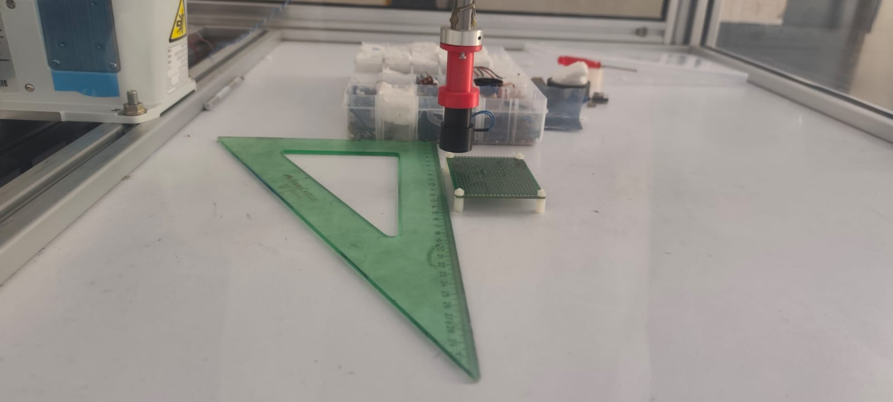* |
| **Prueba de Agarre** | Verificación de sujeción electromagnética (`DO_09`). | *(Insertar GIF / Foto Pick)* |

---

## 2. Diagrama de flujo del proceso global

El proceso global de la línea automatizada consta de cuatro estaciones robotizadas secuenciales e independientes para la manufactura, ensamble, soldadura y empaque de tarjetas electrónicas (PCBs).


## 3. Diseño del gripper

Se diseño el gripper para los componentes electronicos en torno a un sistema electromagnetico con un electroiman de referencia  P 20/15 facilitado por el profesor , a continuación la siguiente tabla muestra diferentes referencias de electroimanes y sus caracteritisticas :


| Modelo | Diámetro ($\varnothing$) | Altura ($H$) | Fuerza de Sujeción | Potencia Aprox. | Corriente (a 12V) | Rosca de Montaje |
| :--- | :---: | :---: | :---: | :---: | :---: | :---: |
| **P20/15** | 20 mm | 15 mm | 2.5 – 3.0 kg (25–30 N) | ~3 W | ~0.25 A | M3 / M4 |
| **P25/11** | 25 mm | 11 mm | 5.0 kg (50 N) | ~2 W | ~0.17 A | M4 |
| **P25/20** | **25 mm** | **20 mm** | **5.0 – 8.0 kg (50–80 N)** | **2 W – 3.6 W** | **~0.17 A – 0.30 A** | **M4** |
| **P30/22** | 30 mm | 22 mm | 10.0 – 15.0 kg (100–150 N) | ~4 W | ~0.33 A | M4 |
| **P34/25** | 34 mm | 25 mm | 20.0 – 25.0 kg (200–250 N) | ~5 W | ~0.42 A | M4 / M5 |
| **P40/20** | 40 mm | 20 mm | 25.0 – 30.0 kg (250–300 N) | ~8 W | ~0.67 A | M5 |

Con base a sus caracteristicas fisicas y a una herramienta previamente enseñada como inspiraciòn se procedio a hacer el soporte de dicho electroiman, a continuacón se presenta dicho gripper encontrado en el robot :

<p align="center">
  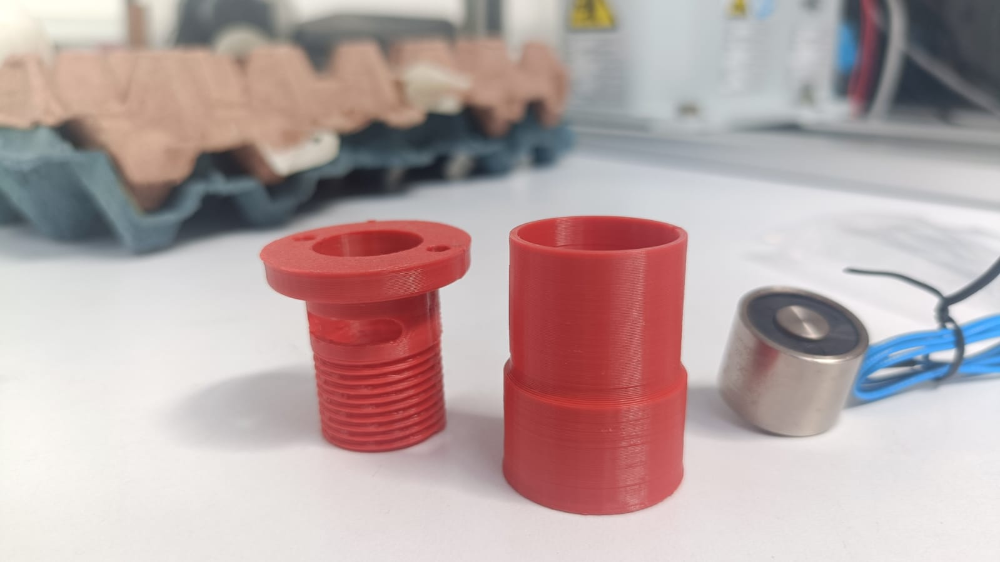
</p>

Tambien se presentan las imagenes del electroiman utilizado :


<p  align="center">
  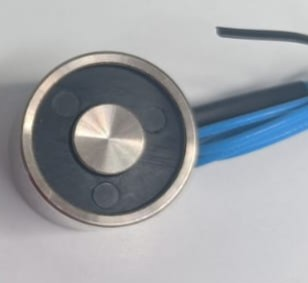
  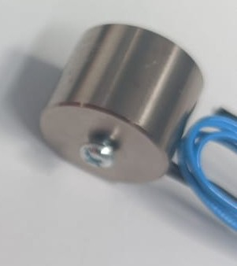
</p>


El diseño se inspiro de igual forma en otra herramienta previamente instalada en el robot para el diseño de la primera parte atornillada : 


<p  align="center">
  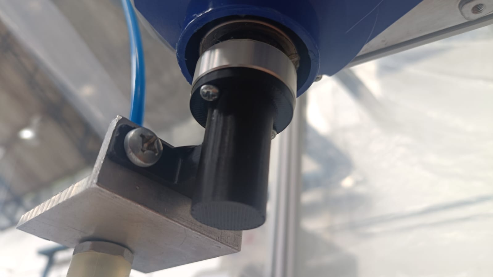
  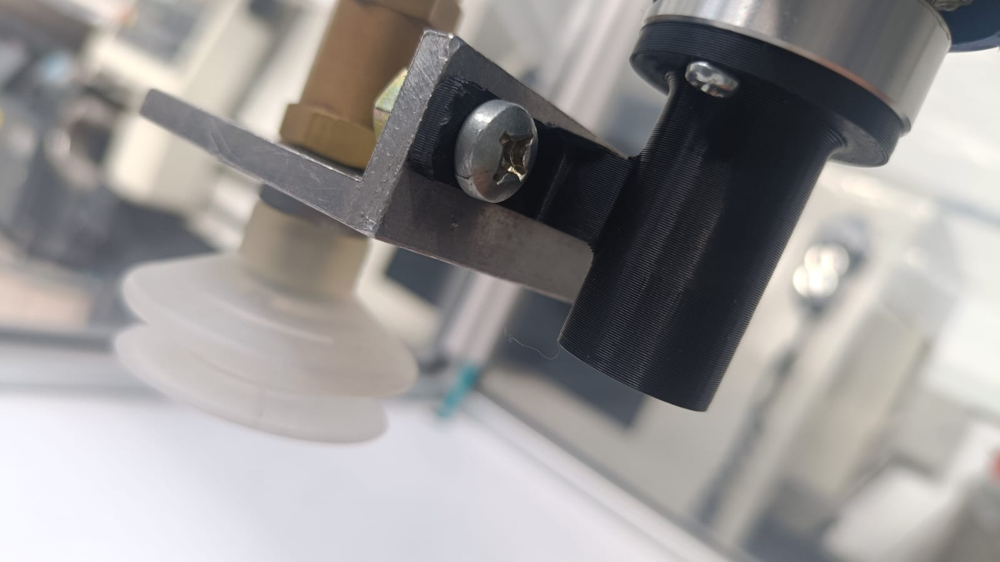
</p>


Observando el diseño, se optó por realizar un ensamblaje de dos partes: una fija a la punta del robot atornillada a este, con un orificio en la punta por donde se acoplaría la otra parte por rosca y pasaría el cable del electroimán conectado a su circuito de control por dentro del tornillo sin fin aprovechando su espacio hueco. Se realiza en dos partes para facilitar el ensamblaje rápido de este, y así agilizar tiempos de desacople y acople en realizaciones futuras por posibles fallos, entre otros motivos.

A continuación se muestran imágenes de las partes del ensamblaje de Inventor con su respectivo modelado del electroimán y las dos partes de acople por rosca; de igual forma, se muestra el ensamblaje final 

<p  align="center">
  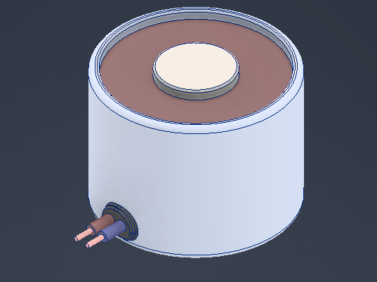
  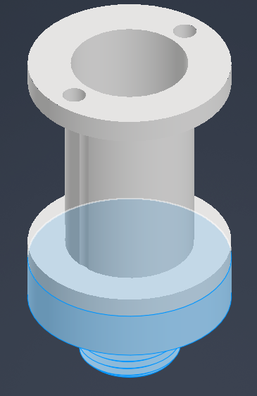
</p>


<p  align="center">
  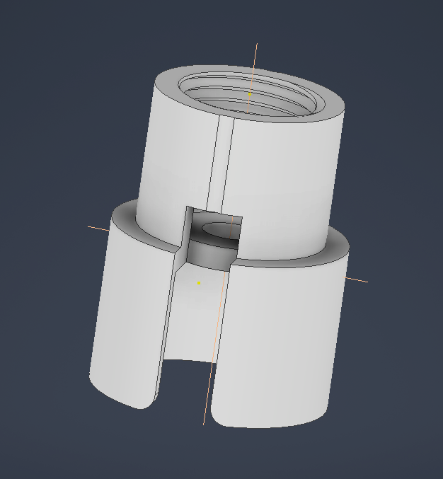
  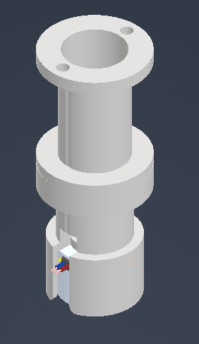
</p>

Se presenta tambien su manufactura en impresión 3D ya atornillada a la punta del robot como su versión final y despegado de este para ver la sección interna y su cable  :

<p  align="center">
  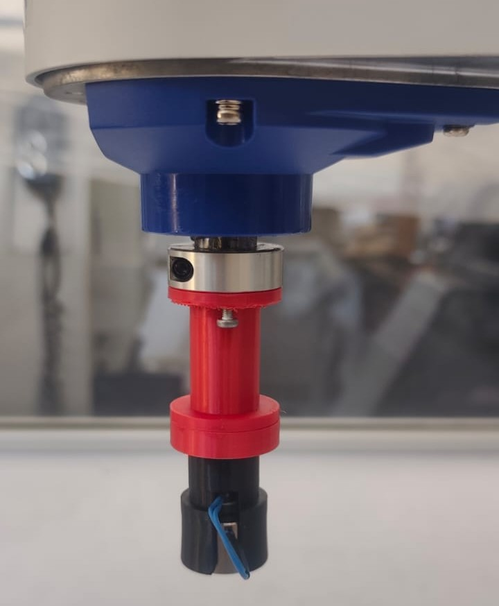
  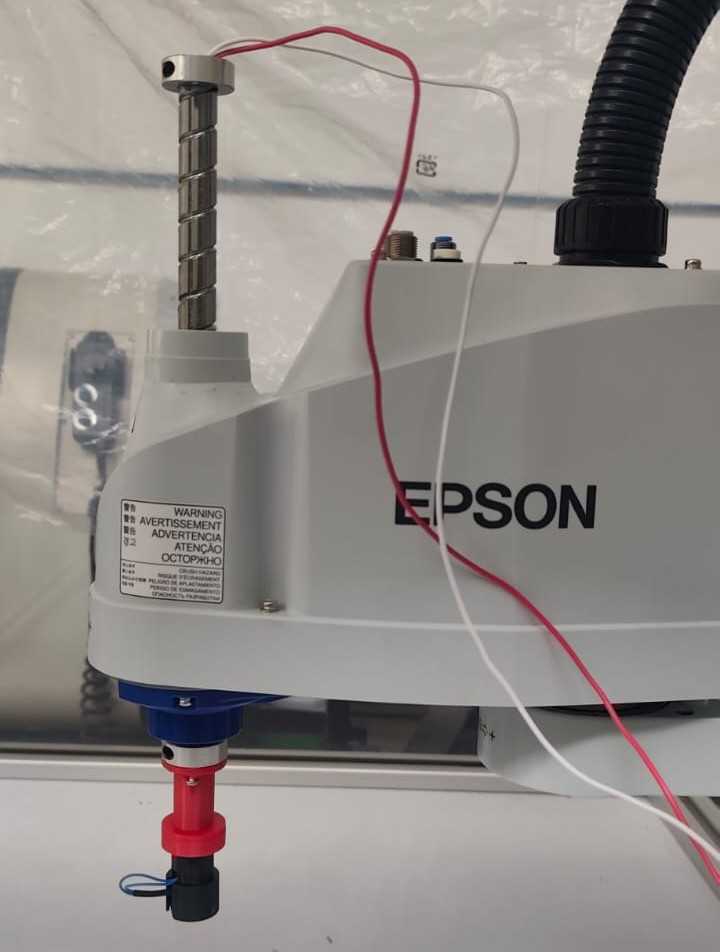
</p>

<p align="center">
  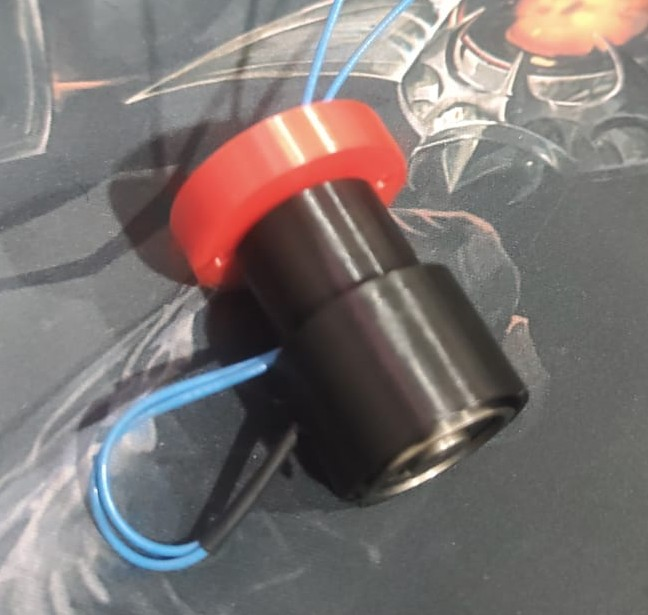
</p>


## 4. Simulación

## 5. Código fuente
El control y automatización de la **Etapa 2: Ensamblaje de Componentes** ejecutada por el robot **Epson T3 401S ("Junior")**  se desarrolló en el entorno **EPSON RC+** empleando el lenguaje de programación **SPEL+**. 

A continuación se detalla la estructura y funcionamiento del código implementado para la manipulación y posicionamiento de componentes mediante el electroimán adaptado.

### Estructura del Código

#### 1. Declaración de Variables Globales
```i```: Variable de control para los iteradores en los bucles de ensamble.
```alm(20)```: Arreglo que almacena las posiciones relativas (índices) de cada componente dentro del almacén ordenado.
```baq(20)```: Arreglo que asigna la posición relativa destino dentro de la tarjeta electrónica (baquela/PCB).
NumComponentes: Determina el número total de piezas a manipular durante la ejecución.

### 2. Rutina Principal (main)
Es el punto de entrada del programa. Establece la configuración de seguridad, velocidad del manipulador y coordina la secuencia global del ciclo de trabajo.
```Power High / Accel / Speed```: Habilita la máxima potencia y fija las velocidades e inercias al 100% para optimizar el tiempo de ciclo.
```Home```: Envía el robot a su posición segura inicial y final para prevenir colisiones durante el encendido o parada.
Llamado a subrutinas: Ejecuta de manera secuencial la asignación de posiciones y el proceso de pick & place.

### 3. Mapeo de Componentes (CargarComponente)
Define la relación entre el origen (almacén) y el destino (baquela) para cada ítem de la receta de ensamble.

### 4. Proceso de Ensamble y Paletizado (EnsambleComponentes)
Configura las mallas de trabajo (pallets) y ejecuta la rutina iterativa de Pick & Place utilizando trayectorias arqueadas para garantizar la seguridad en la inserción.

```Pallet 1```: Define la rejilla del Almacén con una matriz de $6 \times 2$ posiciones.
```Pallet 2```: Define la rejilla de la Baquela con una matriz de $27 \times 22$ posiciones.
```Jump```: Ejecuta un movimiento tipo SCARA Gate (eleva el eje Z, desplaza X/Y y baja Z), evitando obstáculos intermedios entre la zona de almacenamiento y la PCB.

### 5. Control del Actuador Final (Tomar / Soltar)
Gestión del efector final (electroimán) a través de salidas digitales del controlador Epson.

```DO_09```: Salida digital conectada al relé de activación del electroimán. Funciona bajo lógica invertida (o normalmente cerrado según el arreglo físico del relé):
```Off DO_09```: Energiza/activa la sujeción electromagnética para tomar el componente.
```On DO_09```: Desenergiza la herramienta para liberar el componente sobre la PCB.


## 6. Comparación manual vs automatizado

Con el fin de evaluar el impacto de la solución desarrollada, se realizó una comparación entre el proceso de ensamblaje manual de componentes y el proceso automatizado implementado mediante el robot **EPSON T3-401S** equipado con un efector final electromagnético.

Aunque el sistema desarrollado corresponde a un prototipo de laboratorio y no a una línea de producción industrial completamente optimizada, permitió identificar las principales ventajas y limitaciones de la automatización para este tipo de tareas.

| Aspecto | Ensamblaje manual | Ensamblaje automatizado |
|---------|-------------------|-------------------------|
| Repetibilidad | Depende del operador y puede variar entre ciclos. | Alta repetibilidad una vez calibrado el sistema. |
| Precisión de posicionamiento | Depende de la habilidad del operario. | Determinada por la precisión del robot y la correcta calibración de las posiciones. |
| Fatiga del operador | Aumenta con el tiempo y puede generar errores. | No existe fatiga durante la operación automática. |
| Flexibilidad | Permite reaccionar fácilmente ante componentes mal ubicados. | Requiere recalibración o reprogramación para cambios importantes en la disposición de las piezas. |
| Tiempo de operación | Variable entre operadores. | Constante para cada ciclo de trabajo. |
| Riesgo de errores humanos | Alto en tareas repetitivas. | Bajo, dependiendo de la correcta programación y calibración del sistema. |
| Costos iniciales | Bajos. | Elevados debido al robot, controlador y herramienta especializada. |
| Producción continua | Limitada por el operador. | Puede operar continuamente dentro de las limitaciones del sistema. |

### Análisis de resultados

Durante las pruebas realizadas se observó que el robot ejecuta la misma trayectoria en cada ciclo con una elevada repetibilidad, una de las principales ventajas frente al ensamblaje manual. Una vez calibradas las posiciones del almacén y de la zona de trabajo, el sistema fue capaz de repetir la secuencia de recogida y depósito sin intervención del operador.

Sin embargo, también se identificaron limitaciones asociadas principalmente al efector final. A diferencia de un gripper mecánico, el electroimán no restringe completamente la orientación del componente, por lo que pequeñas vibraciones durante el transporte pueden producir ligeras rotaciones que dificultan su colocación exacta sobre la PCB.

Adicionalmente, el calentamiento de la bobina durante periodos prolongados de funcionamiento reduce progresivamente la fuerza magnética disponible, disminuyendo la confiabilidad del agarre en ciclos continuos. Este comportamiento únicamente pudo observarse durante las pruebas experimentales y no fue evidente en la etapa de simulación.

En términos generales, el proyecto permitió demostrar que la automatización mejora significativamente la repetibilidad del proceso y reduce la dependencia del operador, aunque el desempeño final continúa estando condicionado por el diseño del efector final y las características de los componentes manipulados.
## 7. Descripción detallada de la solución

La solución desarrollada corresponde a una estación automatizada para el ensamblaje de componentes electrónicos utilizando un robot **EPSON T3-401S (Junior)** equipado con un efector final basado en un electroimán. Esta estación constituye la segunda etapa de una línea automatizada de manufactura de tarjetas electrónicas (PCB) y tiene como objetivo recoger componentes previamente organizados en un almacén y posicionarlos automáticamente en las ubicaciones definidas sobre la tarjeta.

### Arquitectura del sistema

La estación está conformada por cuatro subsistemas principales:

- **Robot industrial EPSON T3-401S**, encargado de realizar los movimientos de manipulación.
- **Efector final electromagnético**, diseñado e impreso en 3D para sujetar componentes metálicos.
- **Sistema de alimentación y control eléctrico**, compuesto por dos fuentes externas y un módulo relé que permite controlar el electroimán desde las salidas digitales del robot.
- **Software desarrollado en EPSON RC+ mediante SPEL+**, responsable de coordinar toda la secuencia automática de ensamblaje.

La integración de estos subsistemas permite ejecutar de forma automática el proceso completo de **Pick & Place**, desde la recogida del componente hasta su deposición en la posición correspondiente de la PCB.

### Funcionamiento del proceso

El ciclo automático inicia con el robot ubicado en la posición **Home**, donde se habilitan los motores y se configuran los parámetros de velocidad, aceleración y potencia.

Posteriormente se cargan las posiciones de los componentes mediante dos arreglos:

- **alm(i):** almacena la posición de cada componente dentro del almacén.
- **baq(i):** almacena la posición destino correspondiente sobre la PCB.

Una vez cargada la información, el robot ejecuta un ciclo repetitivo para cada componente:

1. Desplazamiento mediante una trayectoria tipo **Jump** hasta el almacén.
2. Descenso a la altura de captura.
3. Activación del electroimán mediante la salida digital **DO_09**.
4. Elevación del componente.
5. Desplazamiento hacia la posición correspondiente en la PCB.
6. Descenso hasta la altura de colocación.
7. Desactivación del electroimán para liberar la pieza.
8. Retorno a una altura segura para iniciar el siguiente ciclo.

Al finalizar el ensamblaje de todos los componentes, el robot retorna nuevamente a la posición **Home**, concluyendo el proceso automático.

### Organización del espacio de trabajo

Con el fin de simplificar la programación, las posiciones del almacén y de la tarjeta electrónica fueron definidas mediante las herramientas de **Pallet** disponibles en EPSON RC+.

Se configuraron dos mallas independientes:

- **Pallet 1:** almacén de componentes.
- **Pallet 2:** posiciones de montaje sobre la PCB.

Esta estrategia permite modificar la distribución física de las piezas sin alterar la lógica principal del programa, ya que únicamente es necesario actualizar los puntos de referencia de cada malla.

### Sistema de agarre

La herramienta de manipulación consiste en un electroimán montado sobre un soporte diseñado en Autodesk Inventor e impreso mediante manufactura aditiva.

El soporte está conformado por dos piezas ensambladas mediante una unión roscada, lo que facilita el montaje, mantenimiento y reemplazo de la herramienta. Además, el diseño permite conducir el cableado del electroimán por el interior del soporte hasta el circuito de control, mejorando la protección mecánica y el acabado del conjunto.

El accionamiento del electroimán se realiza mediante un módulo relé controlado por una salida digital del robot, mientras que la alimentación eléctrica es suministrada por fuentes externas debido a que la corriente requerida supera la capacidad del controlador del robot.

### Interfaz de operación

Con el propósito de facilitar la interacción con la estación se desarrolló una interfaz HMI utilizando el **GUI Builder** de EPSON RC+.

Desde esta interfaz el operador puede iniciar o detener el ciclo automático, enviar el robot a la posición Home, reiniciar el sistema después de una falla y supervisar el estado del proceso mediante indicadores que muestran el componente procesado, el avance del ensamblaje y los posibles mensajes de alarma.

### Integración y validación

La implementación experimental permitió validar el funcionamiento conjunto del sistema mecánico, eléctrico y de control.

Durante las pruebas fue necesario calibrar las posiciones del almacén, ajustar diferentes alturas de aproximación para cada componente e incorporar tiempos de espera que mejoraron la estabilidad del proceso. Asimismo, se comprobó que el calentamiento progresivo del electroimán disminuye la fuerza de sujeción disponible, representando la principal limitación del sistema desarrollado.

En conjunto, la solución implementada demuestra la viabilidad de automatizar el proceso de ensamblaje de componentes electrónicos mediante un robot SCARA, integrando diseño mecánico, control eléctrico, programación industrial e interfaz de supervisión en una única estación de trabajo.
## Diseño HMI

La interfaz HMI desarrollada para la estación de ensamblaje con el robot Epson T3 401S fue diseñada con el objetivo de facilitar la operación y supervisión del proceso de ensamblaje de componentes sobre la PCB.

El diseño se realizó en el apartado de GUI Builder de EPSON RC+, buscando una interfaz simple, clara y orientada a mostrar únicamente la información necesaria para el operador. para lo cual se uso:


### Elementos de la HMI – Epson T3 401S

| Nombre del elemento | Tipo | Función | Comportamiento / información mostrada |
|---|---|---|---|
| `btnStart` | Botón | Iniciar el ciclo automático de ensamble | Ejecuta la rutina `TareaEnsamble` en la Task 5 si no existe un ciclo en ejecución. |
| `btnStop` | Botón | Detener el ciclo de ensamble | Finaliza la Task 5 y desactiva la salida `DO_09` correspondiente al sistema de agarre. |
| `btnHome` | Botón | Llevar el robot a la posición Home | Solo permite ejecutar `Home` cuando no existe un ciclo de ensamble en ejecución. |
| `tbnReset` | Botón | Restablecer el sistema después de una falla o parada | Ejecuta `Reset`, desactiva `DO_09` y devuelve los indicadores de la HMI a un estado inicial. |
| `lblEstado` | Label dinámico | Mostrar el estado general de la estación | Puede mostrar estados como `IDLE`, `RUN`, `FAULT` y `DONE`. |
| `lblOperacion` | Label dinámico | Mostrar la operación que está realizando actualmente el robot | Muestra mensajes como `Ejecutando HOME`, `Realizando PICK`, `Trasladando componente`, `Realizando PLACE` o `Ensamble finalizado`. |
| `lblComponente` | Label dinámico | Indicar el componente que se está procesando | Muestra el número del componente actual, por ejemplo: `Componente actual: 4`. |
| `lblProgreso` | Label dinámico | Mostrar el avance del ensamble | Indica la cantidad de componentes colocados respecto al total, por ejemplo: `Progreso: 6 / 10`. |
| `lblReceta` | Label informativo | Mostrar la receta de ensamble seleccionada | Identifica la PCB o receta actualmente cargada, por ejemplo: `Receta: PCB-01`. |
| `lblAlarma` | Label dinámico | Mostrar alarmas, advertencias o condiciones anormales | Normalmente muestra `Alarma: Sin alarmas`; puede indicar ciclo ya iniciado, proceso detenido, imposibilidad de ejecutar Home u otras fallas. |


teniendo como resultado final:

<br>
<div align="center">
  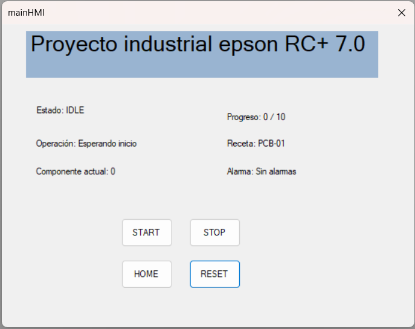
  <br>
  <b>Figura 5. Diseño de HMI.</b>
</div>
<br>

## 8. Diagrama de flujo acciones del robot
El siguiente diagrama detalla la secuencia algorítmica y la toma de decisiones que ejecuta el robot  durante la **Etapa 2: Ensamblaje de Componentes**, reflejando la lógica programada en **SPEL+**:

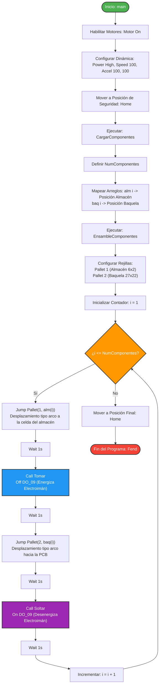

## 9. Plano de planta
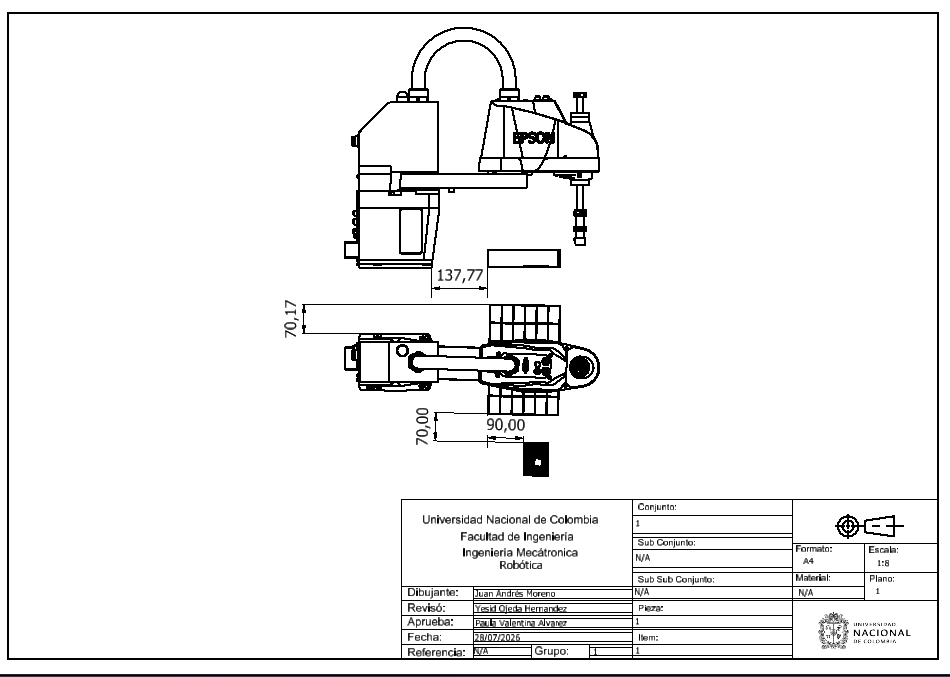


## 10. Videos demostrativos
Los videos demostrativos estan subidos en este repositorio en la carpeta de ```videos```
