<div align="center">
<picture>
    <source srcset="https://imgur.com/5bYAzsb.png" media="(prefers-color-scheme: dark)">
    <source srcset="https://imgur.com/Os03JoE.png" media="(prefers-color-scheme: light)">
    
</picture>

<h3>Curso de Robótica 2026-I</h3>

<h1>Proyecto Final - Robótica Industrial</h1>

<h2>Profesores: <br>Pedro Fabián Cárdenas Herrera <br> Manuel Felipe Carranza Montenegro<br></h2>

<p>
  
  
  
</p>

<br>
<br>
<b>Figura 1. Manipulador industrial EPSON T3-401S.</b>
</div>

</div>

# Integrantes
1. Juan Andrés Moreno Benavides [jumorenobe@unal.co](Jumorenobe)
2. Mateo Ramos Cujer [mramoscu@unal.edu.co](MateoKGR)
3. Paula Valentina Alvarez Chaparro [palvarezch@unal.edu.co] (Vaulentzc)
4. Yesid Camilo Ojeda Hernández [yojeda@unal.edu.co] (YojedaMt)
5. David Felipe Cardenas Cubides [dcardenascu@unal.edu.co] (dcardenascu)

# Índice

1. [Bitácora del desarrollo](#bitacora-del-desarrollo)
2. [Diagrama de flujo del proceso global](#diagrama-de-flujo-del-proceso-global)
3. [Diseño del gripper](#diseño-del-gripper)
4. [Simulación](#simulacion)
5. [Código fuente](#codigo-fuente)
6. [Comparación manual vs automatizado](#comparacion-manual-vs-automatizado)
7. [Descripción detallada de la solución](#descripcion-detallada-de-la-solución)
8. [Diagrama de flujo acciones del robot](#diagrama-de-flujo-acciones-del-robot)
9. [Plano de planta](#plano-de-planta)
10. [Videos demostrativos](#videos-demostrativos)

## 1. Bitácora del desarrollo

A continuación se documenta el proceso cronológico de diseño, simulación, fabricación e integración en laboratorio para el desarrollo de la **Etapa 2: Ensamblaje de Componentes** con el robot **Epson T3 401S ("Junior")**.

---

# Fase 1: Definición de Requerimientos y Diseño Mecánico

## Definición de requerimientos

El objetivo principal de la herramienta es permitir la manipulación automática de componentes electrónicos mediante un brazo robótico, siendo capaz de recoger una pieza desde una ubicación determinada y depositarla en otra con la mayor precisión posible. Debido a que la aplicación está orientada al manejo de componentes para PCB, resulta especialmente importante mantener la orientación de la pieza durante todo el proceso, ya que una rotación indeseada dificultaría o impediría su colocación correcta.

A partir de estos objetivos se definieron los siguientes requerimientos de diseño:

- Ser capaz de levantar componentes electrónicos de diferentes tamaños.
- Poder activarse y desactivarse mediante una señal de control.
- Mantener la orientación del componente durante el transporte, en la medida de lo posible.
- Tener un diseño mecánico sencillo para facilitar tanto su fabricación como su integración con el brazo robótico.
- Minimizar la complejidad de la simulación y del sistema de control.

Con estos criterios se evaluaron distintas alternativas para la herramienta de agarre.

---

## Alternativa 1: Ventosa de vacío

La primera opción considerada fue una **ventosa de vacío**, accionada mediante un sistema electroneumático. Esta alternativa presentaba la ventaja de que el laboratorio ya disponía de una herramienta funcional, reduciendo considerablemente el tiempo de diseño y fabricación.


Entre sus principales ventajas se encuentran:

- Diseño ya disponible y probado.
- Activación sencilla mediante electroválvulas.
- Integración relativamente simple con el sistema de control.
- Capacidad de manipular componentes de diferentes materiales.

Sin embargo, durante el análisis se identificaron varias limitaciones importantes para la aplicación propuesta.

La fuerza de succión se distribuye sobre una superficie relativamente amplia, lo que hace que el punto exacto de contacto dependa de la geometría de la pieza. Además, durante el momento en que la ventosa entra en contacto con el componente es frecuente que éste gire o cambie ligeramente de posición antes de quedar completamente adherido.

Como consecuencia, la orientación final del componente resulta poco repetible, lo cual representa una desventaja significativa cuando posteriormente debe colocarse sobre una PCB con una orientación específica.

Por estas razones, aunque la ventosa constituye una solución robusta para tareas generales de manipulación, no se consideró la alternativa más adecuada para este proyecto.

---

## Alternativa 2: Electroimán

La segunda alternativa consistió en diseñar una herramienta basada en un **electroimán**.

Un electroimán funciona aprovechando el fenómeno del **electromagnetismo**: cuando una corriente eléctrica circula por una bobina, se genera un campo magnético capaz de atraer materiales ferromagnéticos. Al interrumpir la corriente, el campo desaparece prácticamente por completo, permitiendo liberar el componente de manera controlada.


Esta alternativa presentaba varias ventajas frente a la ventosa:

- Activación y desactivación mediante una simple señal eléctrica.
- Mayor precisión en el punto de contacto.
- Menor probabilidad de modificar la orientación del componente durante la recogida.
- Diseño compacto y fácilmente integrable al efector final del robot.
- Capacidad de sujetar componentes metálicos sin necesidad de generar vacío.

No obstante, también fue necesario considerar algunas desventajas:

- La herramienta debía diseñarse y fabricarse prácticamente desde cero.
- Requiere una corriente relativamente elevada para generar una fuerza de atracción suficiente.
- El calentamiento de la bobina produce un aumento de su resistencia eléctrica. Como consecuencia, la corriente disminuye y, con ella, la intensidad del campo magnético generado. Este fenómeno, conocido como **desmagnetización térmica** o **pérdida de fuerza por calentamiento**, provoca una reducción progresiva de la capacidad de sujeción mientras el electroimán permanece energizado.
- Si los componentes se encuentran demasiado próximos entre sí, el campo magnético puede atraer simultáneamente más de una pieza, por lo que es necesario mantener una separación adecuada durante el almacenamiento.

A pesar de estas limitaciones, las ventajas relacionadas con la precisión y el control de la orientación hicieron que esta alternativa resultara considerablemente más adecuada para los objetivos del proyecto.

---

## Selección de la herramienta

Después de analizar ambas opciones se decidió implementar el **electroimán** como herramienta principal del brazo robótico.

Aunque implicaba un mayor trabajo de diseño y fabricación, esta solución ofrecía un mejor compromiso entre precisión, simplicidad del sistema de control y repetibilidad del proceso de manipulación, aspectos fundamentales para una aplicación orientada al ensamblaje de componentes electrónicos.

La selección del electroimán también hizo necesario diseñar un sistema de almacenamiento para los componentes. Este almacén debía mantener las piezas organizadas, suficientemente separadas para evitar capturas múltiples y con una disposición que facilitara el acceso del brazo robótico.

---

## Diseño del almacén de componentes

Como complemento de la herramienta se diseñó una caja de almacenamiento que permite organizar los componentes electrónicos antes de ser manipulados.


El diseño del almacén busca cumplir varios objetivos:

- Mantener las piezas ordenadas y fácilmente accesibles.
- Evitar que el campo magnético del electroimán capture más de un componente simultáneamente.
- Facilitar la identificación de la posición de cada componente durante la operación.
- Proporcionar una estructura estable para las pruebas experimentales.
- Permitir futuras ampliaciones del sistema para manejar un mayor número de referencias.

Con el diseño mecánico de la herramienta y del sistema de almacenamiento definidos, fue posible avanzar hacia las etapas de fabricación, caracterización del electroimán e integración con el sistema robótico.
> **[Agregen mas info]:** *Agregar especificaciones del material del gripper (impresión 3D PLA/PETG) y dimensiones exactas de la caja/almacén utilizada.*

---

### Fase 2: Programación Inicial y Simulación (EPSON RC+)

* **Desarrollo del Código SPEL+:**
  * Implementación de la rutina lógica principal (`main`) y declaración de matrices globales para el mapeo de posiciones de origen (`alm`) y destino (`baq`).
  * Configuración de mallas de paletizado mediante las funciones `Pallet 1` (Almacén) y `Pallet 2` (Baquela).
* **Simulación Virtual:**
  * Verificación preliminar de trayectorias tipo `Jump` dentro del entorno virtual de **EPSON RC+** para garantizar que la elevación en $Z$ fuera suficiente para esquivar bordes de la caja y elementos sobre la PCB.

> **[Agregen foto de la simulación]:** *Adjuntar captura de pantalla de la simulación en EPSON RC+ con la malla de paletizado generada.*

---

### Fase 3: Integración Hardware y Control Eléctrico

En esta fase se realizó la integración entre el robot, la herramienta de manipulación y el sistema de control eléctrico. Debido a que el electroimán requería un consumo de corriente superior al que podía suministrar directamente la salida del controlador del robot, fue necesario contar con el apoyo del profesor para diseñar una solución de alimentación adecuada. Para ello se implementó un sistema compuesto por dos fuentes de alimentación externas y un módulo relé, el cual permitía que el robot controlara el encendido y apagado del electroimán mediante una señal digital, aislando el circuito de potencia del circuito de control y garantizando un funcionamiento seguro.

Una vez completada la instalación eléctrica se realizaron pruebas de funcionamiento para verificar el correcto accionamiento del electroimán y la sincronización entre el movimiento del robot y la activación de la herramienta. Durante estas pruebas también se validaron los parámetros obtenidos previamente en el gemelo digital, comprobando que las posiciones de aproximación y recogida fueran alcanzables en el sistema físico sin generar colisiones.

La experimentación permitió identificar diversas limitaciones que no habían sido evidentes durante la etapa de simulación. En primer lugar, se determinaron con mayor precisión los límites del eje **Z**, estableciendo la distancia mínima y máxima de operación para garantizar una correcta captura de las piezas sin que la herramienta impactara contra la superficie de trabajo.

Adicionalmente, se observaron restricciones propias del hardware relacionadas con el comportamiento del electroimán durante periodos prolongados de operación. Debido al efecto Joule, la bobina incrementaba progresivamente su temperatura, provocando un aumento de su resistencia eléctrica y una reducción de la corriente que circulaba por ella. Como consecuencia, la fuerza magnética disponible disminuía con el tiempo, afectando directamente la capacidad de sujeción de las piezas.

Esta disminución de la fuerza de agarre produjo comportamientos diferentes dependiendo del tipo de componente manipulado y de su geometría. Algunas piezas eran levantadas correctamente, mientras que otras presentaban ligeros desplazamientos o rotaciones durante el transporte. Estas variaciones en la orientación final se acumulaban a lo largo del proceso y terminaron afectando la precisión del ensamblaje, especialmente en los últimos componentes de la PCB, donde las tolerancias de posicionamiento eran más estrictas.

Los resultados obtenidos en esta fase evidenciaron la importancia de considerar no solo las restricciones cinemáticas y geométricas del sistema, sino también los fenómenos eléctricos y térmicos asociados a la herramienta de manipulación. Estas pruebas permitieron ajustar los parámetros de operación y definir las limitaciones reales del sistema antes de realizar la integración completa del proceso de ensamblaje.


---

### Fase 4: Pruebas en Laboratorio y Calibración de Trabajo (Iterativas)

Debido a las variaciones entre el modelo virtual y el montaje real, se realizaron múltiples visitas al laboratorio para ajustar los parámetros de precisión:

* **Visita 1 - Calibración de Puntos y Frames:**
  * Definición manual de los puntos origen y ejes ($X, Y$) para `Pallet 1` (Caja almacén) y `Pallet 2` (Baquela/PCB) usando el Jog de EPSON RC+.
  * Ajuste de altura de seguridad $Z$ para evitar choques con las paredes de la caja de componentes.
* **Visita 2 - Ajuste de Agarre Electromagnético:**
  * Pruebas de campo para verificar la atracción y liberación de las borneras/componentes metálicos.
  * **Problema detectado:** La remanencia magnética causaba que algunos componentes no se soltaran inmediatamente al apagar el electroimán.
  * **Solución aplicada:** Ajuste de tiempos de espera (`Wait 1`) en las subrutinas `Tomar` y `Soltar` para dar estabilidad al proceso.
* **Visita 3 - Calibración Fine-Tuning y Pruebas de Repetibilidad:**
  * Corrección milimétrica de las coordenadas de la baquela para asegurar que las terminales de los componentes alinearan correctamente con los orificios de la PCB.
  * Verificación del ciclo completo a velocidad real (`Speed 100`, `Accel 100 100`).

> **[Agregen mas info aquí]:** *Agregar tabla o registro de fallos encontrados durante las pruebas de campo y cómo se corrigieron.*

---

### Evidencias del Desarrollo

| Hito / Actividad | Descripción | Evidencia Fotográfica / Video |
| :--- | :--- | :---: |
| **Diseño CAD Herramienta** | Modelo 3D del soporte para el electroimán. | *(Insertar Imagen CAD)* |
| **Acondicionamiento Almacén** | Caja seleccionada con componentes ordenados. | ** |
| **Calibración en Lab** | Ajuste de puntos de paletizado en el Epson T3. | ** |
| **Prueba de Agarre** | Verificación de sujeción electromagnética (`DO_09`). | *(Insertar GIF / Foto Pick)* |

---

## 2. Diagrama de flujo del proceso global

El proceso global de la línea automatizada consta de cuatro estaciones robotizadas secuenciales e independientes para la manufactura, ensamble, soldadura y empaque de tarjetas electrónicas (PCBs).

```mermaid
flowchart TD
    %% Inicio del sistema
    START([Inicio del Proceso Global]) --> HMI_INIT[Selección de Receta y Start en HMI]
    
    %% ETAPA 1
    subgraph E1["Etapa 1: Clasificación y Ordenamiento (ABB IRB 140 - Caín)"]
        E1_IN[Llegada de componentes en desorden por banda transportadora] --> E1_VIS["Visión Artificial (Kinect + MATLAB):<br/>Detección e Identificación de Tipo/Pose"]
        E1_VIS --> E1_PICK[Pick de componente en banda]
        E1_PICK --> E1_DEC{¿Clasificación exitosa?}
        E1_DEC -- Sí --> E1_PLACE[Place en celda correspondiente del Almacén Ordenado]
        E1_DEC -- No / Duda --> E1_REJ[Depositar en Bandeja de Rechazo / Alarma HMI]
        E1_PLACE --> E1_COUNT[Incrementar Conteo por Tipo]
        E1_COUNT --> E1_CHECK{¿Almacén Completo?<br/>N >= 30 componentes}
        E1_CHECK -- No --> E1_IN
        E1_CHECK -- Sí --> E1_READY[Señal: Almacén Listo / Transfiriendo]
    end

    HMI_INIT --> E1_IN

    %% ETAPA 2
    subgraph E2["Etapa 2: Ensamblaje en PCB (Epson T3 401S - Junior)"]
        E2_SETUP[Fijar PCB en Fixture de Estación Epson] --> E2_RECIP[Cargar Receta de Posiciones X, Y, Ángulo]
        E2_RECIP --> E2_LOOP_INIT[Inicializar i = 1]
        E2_LOOP_INIT --> E2_LOOP_CHK{¿i <= N_componentes?}
        E2_LOOP_CHK -- Sí --> E2_PICK[Pick desde Almacén Ordenado con Electroimán]
        E2_PICK --> E2_PLACE[Jump Place/Inserción en coordenadas destino en PCB]
        E2_PLACE --> E2_INC[i = i + 1]
        E2_INC --> E2_LOOP_CHK
        E2_LOOP_CHK -- No --> E2_VERIF[Inspección Visual Rápida / Foto Final]
        E2_VERIF --> E2_READY[Señal: PCB Poblada / Transfiriendo]
    end

    E1_READY --> E2_SETUP

    %% ETAPA 3
    subgraph E3["Etapa 3: Soldadura (Yaskawa Motoman MH6 - El Chambeador)"]
        E3_SETUP[Fijar PCB Poblada en Fixture de Soldadura] --> E3_PATH[Cargar Rutina y Patrón de Puntos P1..PN]
        E3_PATH --> E3_EXEC[Ejecución de Trayectoria de Soldadura / Puntos]
        E3_EXEC --> E3_LOG[Generación de Log de Registro Explicito]
        E3_LOG --> E3_READY[Señal: PCB Soldada / Transfiriendo]
    end

    E2_READY --> E3_SETUP

    %% ETAPA 4
    subgraph E4["Etapa 4: Empaque y Envío (ABB IRB 140 - Abel)"]
        E4_PICK[Pick de PCB Soldada desde Estación 3] --> E4_PACK[Colocar en Caja/Bandeja de Empaque]
        E4_PACK --> E4_LABEL[Colocar Etiqueta de Lote]
        E4_LABEL --> E4_BELT[Depositar en Banda Transportadora de Salida]
        E4_BELT --> E4_COUNT[Incrementar Contador de Producción en HMI]
    end

    E3_READY --> E4_PICK
    E4_COUNT --> END([Fin del Proceso - Producto Empacado])

    %% Estilos de Nodos
    style START fill:#4CAF50,stroke:#333,stroke-width:2px,color:#fff
    style END fill:#2196F3,stroke:#333,stroke-width:2px,color:#fff
    style E1 fill:#FFF3E0,stroke:#FF9800,stroke-width:2px
    style E2 fill:#E8F5E9,stroke:#4CAF50,stroke-width:2px
    style E3 fill:#E1F5FE,stroke:#03A9F4,stroke-width:2px
    style E4 fill:#F3E5F5,stroke:#9C27B0,stroke-width:2px
```



## 3. Diseño del gripper

Se diseño el gripper para los componentes electronicos en torno a un sistema electromagnetico con un electroiman de referencia  P 20/15 facilitado por el profesor , a continuación la siguiente tabla muestra diferentes referencias de electroimanes y sus caracteritisticas :


| Modelo | Diámetro ($\varnothing$) | Altura ($H$) | Fuerza de Sujeción | Potencia Aprox. | Corriente (a 12V) | Rosca de Montaje |
| :--- | :---: | :---: | :---: | :---: | :---: | :---: |
| **P20/15** | 20 mm | 15 mm | 2.5 – 3.0 kg (25–30 N) | ~3 W | ~0.25 A | M3 / M4 |
| **P25/11** | 25 mm | 11 mm | 5.0 kg (50 N) | ~2 W | ~0.17 A | M4 |
| **P25/20** | **25 mm** | **20 mm** | **5.0 – 8.0 kg (50–80 N)** | **2 W – 3.6 W** | **~0.17 A – 0.30 A** | **M4** |
| **P30/22** | 30 mm | 22 mm | 10.0 – 15.0 kg (100–150 N) | ~4 W | ~0.33 A | M4 |
| **P34/25** | 34 mm | 25 mm | 20.0 – 25.0 kg (200–250 N) | ~5 W | ~0.42 A | M4 / M5 |
| **P40/20** | 40 mm | 20 mm | 25.0 – 30.0 kg (250–300 N) | ~8 W | ~0.67 A | M5 |

Con base a sus caracteristicas fisicas y a una herramienta previamente enseñada como inspiraciòn se procedio a hacer el soporte de dicho electroiman, a continuacón se presenta dicho gripper encontrado en el robot :

<p align="center">
  
</p>

Tambien se presentan las imagenes del electroiman utilizado :


<p  align="center">
  
  
</p>


El diseño se inspiro de igual forma en otra herramienta previamente instalada en el robot para el diseño de la primera parte atornillada : 


<p  align="center">
  
  
</p>


Observando el diseño, se optó por realizar un ensamblaje de dos partes: una fija a la punta del robot atornillada a este, con un orificio en la punta por donde se acoplaría la otra parte por rosca y pasaría el cable del electroimán conectado a su circuito de control por dentro del tornillo sin fin aprovechando su espacio hueco. Se realiza en dos partes para facilitar el ensamblaje rápido de este, y así agilizar tiempos de desacople y acople en realizaciones futuras por posibles fallos, entre otros motivos.

A continuación se muestran imágenes de las partes del ensamblaje de Inventor con su respectivo modelado del electroimán y las dos partes de acople por rosca; de igual forma, se muestra el ensamblaje final 

<p  align="center">
  
  
</p>


<p  align="center">
  
  
</p>

Se presenta tambien su manufactura en impresión 3D ya atornillada a la punta del robot como su versión final y despegado de este para ver la sección interna y su cable  :

<p  align="center">
  
  
</p>

<p align="center">
  
</p>


## 4. Simulación

## 5. Código fuente
El control y automatización de la **Etapa 2: Ensamblaje de Componentes** ejecutada por el robot **Epson T3 401S ("Junior")**  se desarrolló en el entorno **EPSON RC+** empleando el lenguaje de programación **SPEL+**. 

A continuación se detalla la estructura y funcionamiento del código implementado para la manipulación y posicionamiento de componentes mediante el electroimán adaptado.

### Estructura del Código

#### 1. Declaración de Variables Globales
```i```: Variable de control para los iteradores en los bucles de ensamble.
```alm(20)```: Arreglo que almacena las posiciones relativas (índices) de cada componente dentro del almacén ordenado.
```baq(20)```: Arreglo que asigna la posición relativa destino dentro de la tarjeta electrónica (baquela/PCB).
NumComponentes: Determina el número total de piezas a manipular durante la ejecución.

### 2. Rutina Principal (main)
Es el punto de entrada del programa. Establece la configuración de seguridad, velocidad del manipulador y coordina la secuencia global del ciclo de trabajo.
```Power High / Accel / Speed```: Habilita la máxima potencia y fija las velocidades e inercias al 100% para optimizar el tiempo de ciclo.
```Home```: Envía el robot a su posición segura inicial y final para prevenir colisiones durante el encendido o parada.
Llamado a subrutinas: Ejecuta de manera secuencial la asignación de posiciones y el proceso de pick & place.

### 3. Mapeo de Componentes (CargarComponente)
Define la relación entre el origen (almacén) y el destino (baquela) para cada ítem de la receta de ensamble.

### 4. Proceso de Ensamble y Paletizado (EnsambleComponentes)
Configura las mallas de trabajo (pallets) y ejecuta la rutina iterativa de Pick & Place utilizando trayectorias arqueadas para garantizar la seguridad en la inserción.

```Pallet 1```: Define la rejilla del Almacén con una matriz de $6 \times 2$ posiciones.
```Pallet 2```: Define la rejilla de la Baquela con una matriz de $27 \times 22$ posiciones.
```Jump```: Ejecuta un movimiento tipo SCARA Gate (eleva el eje Z, desplaza X/Y y baja Z), evitando obstáculos intermedios entre la zona de almacenamiento y la PCB.

### 5. Control del Actuador Final (Tomar / Soltar)
Gestión del efector final (electroimán) a través de salidas digitales del controlador Epson.

```DO_09```: Salida digital conectada al relé de activación del electroimán. Funciona bajo lógica invertida (o normalmente cerrado según el arreglo físico del relé):
```Off DO_09```: Energiza/activa la sujeción electromagnética para tomar el componente.
```On DO_09```: Desenergiza la herramienta para liberar el componente sobre la PCB.

## 6. Comparación manual vs automatizado
## 7. Descripción detallada de la solución

## diseño HMI

La interfaz HMI desarrollada para la estación de ensamblaje con el robot Epson T3 401S fue diseñada con el objetivo de facilitar la operación y supervisión del proceso de ensamblaje de componentes sobre la PCB.

El diseño se realizó en el apartado de GUI Builder de EPSON RC+, buscando una interfaz simple, clara y orientada a mostrar únicamente la información necesaria para el operador. para lo cual se uso:


### Elementos de la HMI – Epson T3 401S

| Nombre del elemento | Tipo | Función | Comportamiento / información mostrada |
|---|---|---|---|
| `btnStart` | Botón | Iniciar el ciclo automático de ensamble | Ejecuta la rutina `TareaEnsamble` en la Task 5 si no existe un ciclo en ejecución. |
| `btnStop` | Botón | Detener el ciclo de ensamble | Finaliza la Task 5 y desactiva la salida `DO_09` correspondiente al sistema de agarre. |
| `btnHome` | Botón | Llevar el robot a la posición Home | Solo permite ejecutar `Home` cuando no existe un ciclo de ensamble en ejecución. |
| `tbnReset` | Botón | Restablecer el sistema después de una falla o parada | Ejecuta `Reset`, desactiva `DO_09` y devuelve los indicadores de la HMI a un estado inicial. |
| `lblEstado` | Label dinámico | Mostrar el estado general de la estación | Puede mostrar estados como `IDLE`, `RUN`, `FAULT` y `DONE`. |
| `lblOperacion` | Label dinámico | Mostrar la operación que está realizando actualmente el robot | Muestra mensajes como `Ejecutando HOME`, `Realizando PICK`, `Trasladando componente`, `Realizando PLACE` o `Ensamble finalizado`. |
| `lblComponente` | Label dinámico | Indicar el componente que se está procesando | Muestra el número del componente actual, por ejemplo: `Componente actual: 4`. |
| `lblProgreso` | Label dinámico | Mostrar el avance del ensamble | Indica la cantidad de componentes colocados respecto al total, por ejemplo: `Progreso: 6 / 10`. |
| `lblReceta` | Label informativo | Mostrar la receta de ensamble seleccionada | Identifica la PCB o receta actualmente cargada, por ejemplo: `Receta: PCB-01`. |
| `lblAlarma` | Label dinámico | Mostrar alarmas, advertencias o condiciones anormales | Normalmente muestra `Alarma: Sin alarmas`; puede indicar ciclo ya iniciado, proceso detenido, imposibilidad de ejecutar Home u otras fallas. |


teniendo como resultado final:

<br>
<div align="center">
  
  <br>
  <b>Figura 5. Diseño de HMI.</b>
</div>
<br>

## 8. Diagrama de flujo acciones del robot
El siguiente diagrama detalla la secuencia algorítmica y la toma de decisiones que ejecuta el robot  durante la **Etapa 2: Ensamblaje de Componentes**, reflejando la lógica programada en **SPEL+**:


## 9. Plano de planta


## 10. Videos demostrativos
Los videos demostrativos estan subidos en este repositorio en la carpeta de ```videos```
